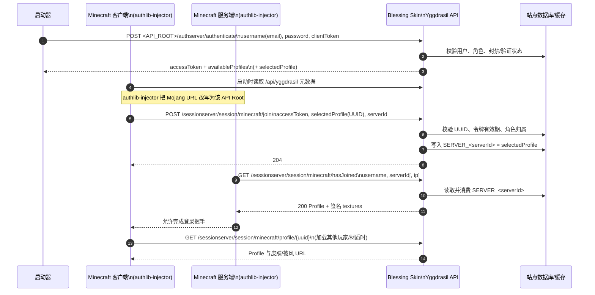

# Blessing Skin 外置登录：玩家进入 Minecraft 服务器的认证流程

本文根据 Blessing Skin 官方仓库及其 `yggdrasil-api` 插件源码整理，说明“玩家必须先通过皮肤站认证，才能进入 Minecraft 服务器”的实现流程。这里的“登录”是启动器通过 Yggdrasil API 登录皮肤站，不是进入服务器后执行 `/login` 命令。

## 1. 组件与前提

涉及四个角色：

| 角色 | 作用 |
| --- | --- |
| 玩家/启动器 | 使用皮肤站账号（当前插件的新账户使用邮箱作为 `username`）获取令牌和角色列表 |
| Minecraft 客户端 | 由 `authlib-injector` 将 Mojang 认证与会话请求改写到皮肤站 API |
| Minecraft 服务端 | `online-mode=true`，同样加载 `authlib-injector`，在放行连接前调用 `hasJoined` |
| Blessing Skin + `yggdrasil-api` | 校验账号、签发令牌、登记一次性进服凭证，并返回角色 UUID 与材质 |

部署必须满足：

1. Blessing Skin 安装并启用 `yggdrasil-api` 插件；API 根地址形如 `https://skin.example.com/api/yggdrasil`。
2. 启动器、客户端 JVM、服务端 JVM 使用同一个 API 根地址并正确加载 `authlib-injector`。
3. 独立服务端在 `server.properties` 中设置 `online-mode=true`。使用 BungeeCord 时，所有服务端都加载 `authlib-injector`，但通常只有 BungeeCord 开启 `online-mode`。
4. 插件配置有效的 PEM 格式 RSA 私钥，长度至少 4096 bit，用于材质属性签名；API 元数据会公开对应公钥。
5. API 必须使用 HTTPS：`authenticate` 会提交邮箱和密码，插件文档明确说明这些信息以明文 HTTP 传输。

官方手册也明确列出该方案的结果：启动器登录后可直接进服、未在启动器登录的玩家不能进服、无需皮肤 Mod 即可显示皮肤（[介绍](https://github.com/bs-community/blessing-skin-manual/blob/4ceeaa83036ecc7b6fff753f4afb10d0580c6683/man/yggdrasil-api/introduction.md#L3-L14)）。

## 2. API 路由

以下表格中的 `<API_ROOT>` 指皮肤站的 `https://skin.example.com/api/yggdrasil`。插件在该根地址下注册以下接口（[README](https://github.com/bs-community/yggdrasil-api/blob/7eb2ceb124b9b7e2d14c90d4473543c7ce920f9c/README.md#L5-L24)、[路由挂载](https://github.com/bs-community/yggdrasil-api/blob/7eb2ceb124b9b7e2d14c90d4473543c7ce920f9c/bootstrap.php#L72-L80)、[路由定义](https://github.com/bs-community/yggdrasil-api/blob/7eb2ceb124b9b7e2d14c90d4473543c7ce920f9c/routes.php#L3-L26)）：

| 阶段 | 方法与路径 | 成功结果 |
| --- | --- | --- |
| 元数据 | `GET <API_ROOT>` | 返回站点信息、`skinDomains`、`signaturePublickey`（[实现](https://github.com/bs-community/yggdrasil-api/blob/7eb2ceb124b9b7e2d14c90d4473543c7ce920f9c/src/Controllers/ConfigController.php#L93-L124)） |
| 登录 | `POST <API_ROOT>/authserver/authenticate` | 返回 `accessToken`、`clientToken`、`availableProfiles`，必要时返回 `selectedProfile` |
| 刷新 | `POST <API_ROOT>/authserver/refresh` | 校验旧令牌并签发新 `accessToken` |
| 校验/吊销 | `POST <API_ROOT>/authserver/validate`、`invalidate`、`signout` | 有效时通常返回 HTTP 204 |
| 客户端报到 | `POST <API_ROOT>/sessionserver/session/minecraft/join` | 校验令牌并登记 `serverId`，成功 HTTP 204 |
| 服务端门禁 | `GET <API_ROOT>/sessionserver/session/minecraft/hasJoined` | 匹配成功返回 Profile；未匹配返回 HTTP 204 |
| Profile | `GET <API_ROOT>/sessionserver/session/minecraft/profile/{uuid}` | 返回 UUID、名称和 `textures` 属性 |
| 名称查询 | `POST <API_ROOT>/api/profiles/minecraft` | 批量把角色名转换为 Profile ID |

`authserver` 路由要求 JSON 请求体，并对 `authenticate`/`signout` 做频率限制（[中间件与路由](https://github.com/bs-community/yggdrasil-api/blob/7eb2ceb124b9b7e2d14c90d4473543c7ce920f9c/routes.php#L3-L17)）。

## 3. 玩家进服时序



### 3.1 启动器认证

1. 启动器向 `authserver/authenticate` 发送 JSON。插件当前把 `username` 当作邮箱，调用 Blessing Skin 用户模型验证密码；不存在、密码错误、封禁或要求邮箱验证但未验证时会拒绝（[认证实现](https://github.com/bs-community/yggdrasil-api/blob/7eb2ceb124b9b7e2d14c90d4473543c7ce920f9c/src/Controllers/AuthController.php#L20-L29)、[凭据检查](https://github.com/bs-community/yggdrasil-api/blob/7eb2ceb124b9b7e2d14c90d4473543c7ce920f9c/src/Controllers/AuthController.php#L260-L304)）。
2. 服务端生成新的 `accessToken`，原样保留或生成 `clientToken`，返回该用户拥有的角色（`availableProfiles`）。只有一个角色时插件自动设置 `selectedProfile`，并把角色 UUID 绑定到令牌（[响应与选角](https://github.com/bs-community/yggdrasil-api/blob/7eb2ceb124b9b7e2d14c90d4473543c7ce920f9c/src/Controllers/AuthController.php#L30-L70)）。
3. 同一邮箱再次认证时，当前实现会撤销该用户之前缓存的令牌；多启动器同时登录时应预期旧令牌失效（同一文件 [L35-L45](https://github.com/bs-community/yggdrasil-api/blob/7eb2ceb124b9b7e2d14c90d4473543c7ce920f9c/src/Controllers/AuthController.php#L35-L45)）。

### 3.2 `authlib-injector` 改写请求

Minecraft 原本访问 Mojang 的认证和会话服务器。`authlib-injector` 在 JVM 启动时读取 API 元数据，并把 `profile`、`join`、`hasJoined` 等 URL 改写到皮肤站；客户端和服务端都必须加载它，且三处 API Root 必须完全一致。官方手册给出的启动参数形式为：

```text
java -Xmx1024M -Xms1024M \
  -javaagent:authlib-injector.jar=https://skin.example.com/api/yggdrasil \
  -jar minecraft_server.jar nogui
```

详见 [官方 Authlib Injector 配置说明](https://github.com/bs-community/blessing-skin-manual/blob/4ceeaa83036ecc7b6fff753f4afb10d0580c6683/man/yggdrasil-api/authlib-injector.md#L3-L59)。

### 3.3 `join`：客户端证明“我已登录”

客户端在真正连接服务器前调用：

```http
POST <API_ROOT>/sessionserver/session/minecraft/join
Content-Type: application/json

{
  "accessToken": "<accessToken>",
  "selectedProfile": "<profile-uuid>",
  "serverId": "<server-id>"
}
```

插件依次执行以下检查：

- `selectedProfile` 必须能在 UUID 映射表中找到，并且对应角色仍存在；
- `accessToken` 必须存在、未超过有效期，并且令牌绑定的角色 UUID 与 `selectedProfile` 一致；
- 角色所属用户不能被封禁。

全部通过后，插件以 `SERVER_<serverId>` 为键缓存该 Profile UUID，并返回 HTTP 204；失败通常返回 HTTP 403（[join 实现](https://github.com/bs-community/yggdrasil-api/blob/7eb2ceb124b9b7e2d14c90d4473543c7ce920f9c/src/Controllers/SessionController.php#L20-L94)）。因此，普通皮肤站账号若没有启动器令牌，或令牌与角色不匹配，就无法生成有效的进服凭证。

源码还保留一个兼容分支：若角色所属用户存在 `mojang_verifications` 记录，插件会把传入的 `accessToken` 转交 `https://authserver.mojang.com/validate` 校验；正版验证通过时也能登记 `serverId`。这属于已绑定 Mojang 账号的例外路径，并非绕过认证（同一文件 [L71-L81](https://github.com/bs-community/yggdrasil-api/blob/7eb2ceb124b9b7e2d14c90d4473543c7ce920f9c/src/Controllers/SessionController.php#L71-L81)）。

### 3.4 `hasJoined`：服务端最终门禁

服务端随后调用：

```http
GET <API_ROOT>/sessionserver/session/minecraft/hasJoined
    ?username=<player-name>&serverId=<server-id>&ip=<client-ip>
```

插件读取 `SERVER_<serverId>`，创建 Profile，并要求请求中的 `username` 与 Profile 名称完全相同。匹配时立即删除该缓存键（一次性消费），返回 HTTP 200 的 Profile；没有匹配的 `join` 记录时返回 HTTP 204。当前源码标注 IP 校验尚未实现，因此 `ip` 只是记录参数，不参与放行判断（[hasJoined 实现](https://github.com/bs-community/yggdrasil-api/blob/7eb2ceb124b9b7e2d14c90d4473543c7ce920f9c/src/Controllers/SessionController.php#L96-L131)）。

Minecraft 服务端只有拿到成功的 Profile 才完成在线模式登录。换言之，皮肤站认证不是进服后的附加步骤，而是服务端在线登录握手的必要条件；`hasJoined` 返回 204 或 403 时，玩家会被拒绝连接。

## 4. UUID、Profile 与材质

- 角色第一次被使用时，插件在 `uuid` 表中为角色名分配 UUID；后续认证和会话均以该 UUID 作为 `selectedProfile`/Profile ID。UUID 算法可配置为兼容离线模式的 v3 或随机 v4（[UUID 生成](https://github.com/bs-community/yggdrasil-api/blob/7eb2ceb124b9b7e2d14c90d4473543c7ce920f9c/src/Models/Profile.php#L130-L171)）。
- Profile 的 `properties[0].name` 为 `textures`，`value` 是 Base64 编码的 JSON，包含时间戳、Profile 信息以及皮肤/披风 URL。
- `hasJoined` 强制调用 `serialize(false)`，因此 `textures` 属性带 RSA 数字签名，并设置 `signatureRequired=true`；客户端使用 `/api/yggdrasil` 元数据中的 `signaturePublickey` 验签（[Profile 序列化与签名](https://github.com/bs-community/yggdrasil-api/blob/7eb2ceb124b9b7e2d14c90d4473543c7ce920f9c/src/Models/Profile.php#L32-L58)、[签名输出](https://github.com/bs-community/yggdrasil-api/blob/7eb2ceb124b9b7e2d14c90d4473543c7ce920f9c/src/Models/Profile.php#L97-L122)）。
- 皮肤文件 URL 指向皮肤站的 `/textures/{hash}` 路径，站点配置中的皮肤域名白名单、HTTPS/CDN 可达性会影响材质加载；认证成功不等于材质图片一定能下载。

## 5. 令牌生命周期

令牌存储在缓存中，`isValid()` 控制短期使用，`isRefreshable()` 控制刷新窗口（[Token 模型](https://github.com/bs-community/yggdrasil-api/blob/7eb2ceb124b9b7e2d14c90d4473543c7ce920f9c/src/Models/Token.php#L15-L59)）。插件启用时的默认值来自 [callbacks.php](https://github.com/bs-community/yggdrasil-api/blob/7eb2ceb124b9b7e2d14c90d4473543c7ce920f9c/callbacks.php#L16-L30)：

| 配置项 | 默认值 | 含义 |
| --- | --- | --- |
| `ygg_token_expire_1` | 259200 秒（3 天） | 令牌可直接用于认证/进服的有效期 |
| `ygg_token_expire_2` | 604800 秒（7 天） | 令牌仍可被 `refresh` 的最长时间 |
| `YGGDRASIL_THROTTLE_INTERVAL_MILLIS` | 1000 毫秒 | 同一账号 `authenticate`/`signout` 请求的最小间隔；由 Redis 原子校验 |

`refresh` 会检查 `clientToken`（如提供）、用户状态和角色归属，然后撤销旧 `accessToken` 并生成新令牌；`validate` 成功返回 204；`invalidate`/`signout` 用于吊销令牌。多实例部署时，认证令牌和 `SERVER_<serverId>` 必须使用共享缓存（插件源码建议 Redis），否则客户端的 `join` 与服务端的 `hasJoined` 可能读到不同节点的数据。

FoxSkinServer 对 `authenticate` 和 `signout` 复用了上述节流语义：默认要求同一账号两次请求间隔 1 秒，命中时返回 `403 ForbiddenOperationException` 和 `Retry-After` 响应头。将间隔配置为 `0` 可关闭，但生产环境不建议关闭。

## 6. 失败点与排查顺序

1. **启动器无法登录**：确认 API Root、邮箱/密码、HTTPS 和 JSON `Content-Type`；检查账号是否封禁或未完成邮箱验证。
2. **启动日志没有 `authlib-injector` 的 `transform ... join/hasJoined`**：客户端或服务端没有加载 Java Agent，或参数位置错误（必须位于 `-jar` 之前）。
3. **元数据请求 403**：检查 CDN/WAF 是否拦截 Java User-Agent 或请求头；官方手册特别提示 Cloudflare 的 Browser Integrity Check。
4. **能进单人游戏但不能进服务器**：核对客户端、服务端和启动器是否使用同一个 API Root；确认服务端 `online-mode=true`，并查看 `join`/`hasJoined` 的 Yggdrasil 日志。
5. **能进服但没有皮肤**：检查 `skinDomains` 白名单、RSA 私钥/公钥是否匹配、`/textures/{hash}` 是否可从客户端访问。该方案不提供高清皮肤/披风，高清材质应使用额外的皮肤 Mod。

插件支持通过 `YGG_VERBOSE_LOG=true` 记录请求和响应，日志位置由插件配置决定，适合在复现一次进服失败后临时开启（[日志钩子](https://github.com/bs-community/yggdrasil-api/blob/7eb2ceb124b9b7e2d14c90d4473543c7ce920f9c/bootstrap.php#L8-L34)）。

## 7. 结论

玩家能否进入服务器取决于一条短链路是否完整：

`皮肤站账号密码` → `accessToken/selectedProfile` → `join(serverId)` → `hasJoined(username, serverId)` → `服务端放行`。

其中任一步失败，尤其是普通账号没有有效令牌、Profile 不属于该账号、`join` 与 `hasJoined` 的 `serverId` 不一致，服务器都会把玩家视为未通过在线认证。已通过 Mojang 正版验证的兼容分支除外。成功后，服务端拿到带签名的 Profile，客户端再按其中的材质 URL 下载皮肤和披风。

## 参考来源

- [bs-community/blessing-skin-server（本文访问提交 52f6efe）](https://github.com/bs-community/blessing-skin-server/tree/52f6fefed08e091c08e409c67e31d00b00ff00ee)
- [bs-community/yggdrasil-api（源码，提交 7eb2ceb）](https://github.com/bs-community/yggdrasil-api/tree/7eb2ceb124b9b7e2d14c90d4473543c7ce920f9c)
- [bs-community/blessing-skin-manual 的 Yggdrasil 文档（提交 4ceeaa8）](https://github.com/bs-community/blessing-skin-manual/tree/4ceeaa83036ecc7b6fff753f4afb10d0580c6683/man/yggdrasil-api)
- [authlib-injector：Yggdrasil 服务端技术规范](https://github.com/yushijinhun/authlib-injector/wiki/Yggdrasil-%E6%9C%8D%E5%8A%A1%E7%AB%AF%E6%8A%80%E6%9C%AF%E8%A7%84%E8%8C%83)

文档整理日期：2026-08-31。
