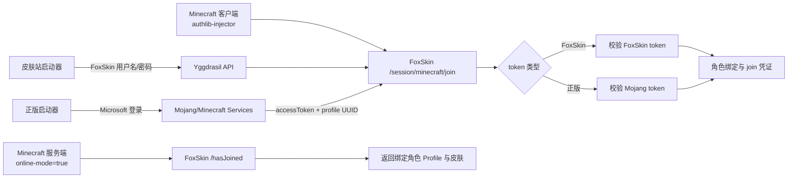

# FoxSkinServer 混合认证设计方案

## 1. 目标与范围

混合认证允许同一 Minecraft 服务器同时接受两类玩家：

1. **FoxSkin 账号**：启动器使用皮肤站账号登录，沿用 FoxSkinServer 当前的 Yggdrasil token 流程。
2. **正版账号**：玩家在官方或兼容微软登录的启动器中完成 Microsoft 登录，服务器通过 Mojang/Minecraft Services 校验其 access token，并使用已绑定的 FoxSkin 角色皮肤。

服务器始终保持 `online-mode=true`。混合认证不是离线模式，也不接受未经验证的玩家名或客户端自报 UUID。

本方案只描述应用和接口设计，不包含数据库迁移脚本。

## 2. 设计原则

- **密码不经过 FoxSkin**：正版登录由 Microsoft/Mojang 完成，FoxSkin 只接收短期 access token 进行服务端校验。
- **UUID 是正版身份主键**：正版账号以 Mojang profile UUID 作为唯一身份，玩家名只用于展示和进服请求匹配。
- **现有协议保持兼容**：FoxSkin 账号继续使用现有 `authenticate`、`refresh`、`validate`、`join`、`hasJoined` 接口。
- **认证分支明确隔离**：每个 `join` 请求只允许被识别为 FoxSkin token 或正版 token 其中一种；识别失败即拒绝。
- **绑定关系由用户主动建立**：正版 UUID 必须先绑定到一个 FoxSkin 用户和角色，避免任意正版账号占用站内皮肤。
- **失败关闭**：Mojang 校验服务不可用时，正版通道拒绝本次进服，不降级为按玩家名放行。
- **正版能力默认关闭**：未开启时完全不执行正版 token 校验，FoxSkin 账号登录和进服不受影响。
- **开关运行时生效**：开关更新后新请求立即读取最新状态，不要求重启应用或重载客户端。

## 3. 总体架构



认证服务由三个组件组成：

- **FoxSkin token store**：继续保存站内 access token 和短期 join 凭证。
- **Mojang verifier**：调用官方验证接口，校验 access token、selected profile 和玩家名。
- **Identity binding service**：查询正版 UUID 与 FoxSkin 用户/角色的绑定关系。

## 4. 两条认证链路

### 4.1 FoxSkin 账号

链路保持不变：

```text
FoxSkin 邮箱/密码
  -> POST /authserver/authenticate
  -> FoxSkin accessToken + selectedProfile
  -> POST /sessionserver/session/minecraft/join
  -> SERVER_<serverId> join 凭证
  -> 服务端 GET /hasJoined
  -> 返回 FoxSkin Profile
```

`authenticate`、`refresh` 和 `validate` 只处理 FoxSkin token。该 token 的格式和 Mojang token 不做强耦合，避免把外部 token 写入站内 token 表。

### 4.2 正版账号

正版启动器先在 Microsoft/Mojang 完成登录。客户端随后由 `authlib-injector` 将会话请求发送到 FoxSkin 的 Yggdrasil API。FoxSkin 在 `join` 阶段识别并校验 Mojang access token：

```text
Microsoft 登录
  -> 客户端 POST /sessionserver/session/minecraft/join
  -> FoxSkin 调用 Mojang validate
  -> 获得正版 profile UUID/name
  -> 查询正版 UUID 绑定的 FoxSkin 角色
  -> 保存 SERVER_<serverId> join 凭证
  -> 服务端 GET /hasJoined
  -> 返回绑定角色的 FoxSkin Profile
```

推荐校验顺序：

1. 校验 `accessToken` 和 `selectedProfile` 字段格式。
2. 使用 `accessToken` 调用 Mojang `POST https://authserver.mojang.com/validate`（或配置的等价官方服务地址）确认令牌有效。
3. 使用同一令牌调用 Minecraft Services profile 接口（`GET /minecraft/profile`，Bearer token），获取官方 UUID 和玩家名。
4. 验证官方 profile UUID 与 `selectedProfile` 相同，并验证官方玩家名与本次会话使用的名称一致；名称变化时以官方返回值更新绑定快照，不以请求参数建立新身份。
5. 查询正版 UUID 绑定的 FoxSkin 角色。
6. 角色存在、所属用户未封禁且绑定状态有效时，写入一次性 join 凭证。

若官方验证返回无效、绑定不存在、用户被封禁或角色不属于绑定用户，返回 Yggdrasil 协议错误，不创建 join 凭证。

## 5. 账号绑定模型

建议增加独立的正版身份绑定概念，不修改现有 `users` 和 `players` 的身份含义。

### 5.1 逻辑字段

`MojangIdentityBinding`：

| 字段 | 含义 |
| --- | --- |
| `id` | 绑定记录主键 |
| `userId` | FoxSkin 用户 ID |
| `playerId` | FoxSkin 角色 ID |
| `mojangUuid` | 去掉连字符的正版 profile UUID，唯一 |
| `mojangName` | 最近一次官方校验得到的玩家名 |
| `verifiedAt` | 最近一次成功校验时间，使用 `LocalDateTime` |
| `status` | `ACTIVE`、`REVOKED` |
| `createdAt` / `updatedAt` | 审计时间，使用 `LocalDateTime` |

约束：

- 一个 `mojangUuid` 同时只能有一条 `ACTIVE` 绑定。
- 一个 FoxSkin 角色默认只绑定一个正版 UUID；若产品需要多正版身份共享皮肤，必须显式开启并增加授权检查。
- 解绑只删除或撤销绑定，不删除正版账号，也不删除 FoxSkin 角色。
- 强制取回只能由官方 profile name 与目标角色名匹配的正版 UUID 触发，不能按名称直接覆盖绑定。

### 5.2 绑定流程

绑定必须由已登录的 FoxSkin 用户发起，推荐使用一次性授权流程：

1. 前端请求创建绑定会话，服务端生成随机 state 和短期过期时间。
2. 用户在官方 Microsoft 登录页面完成登录，并取得一次性 code/token。
3. 后端服务端到服务端交换并校验 token，获取正版 UUID、名称。
4. 用户选择自己的 FoxSkin 角色，服务端检查角色归属后创建绑定。
5. 返回绑定结果和最近校验时间。

不允许用户直接提交 `mojangUuid` 后完成绑定。UUID 必须来自官方校验响应。

当前实现：

- `POST /api/account/mojang-bindings/claim`：提交官方授权结果和目标角色，执行绑定或强制取回；服务端重新校验官方身份，不信任前端传入的 UUID/name。
- `GET /api/account/mojang-bindings`：查看当前用户的绑定和取回状态。
- `DELETE /api/account/mojang-bindings/{id}`：撤销绑定；不会删除角色或历史审计记录。

### 5.3 正版 ID 强制取回

为处理“角色名已被其他用户占用，但正版持有人希望使用自己的正版角色名”的场景，增加**正版 ID 强制取回**功能。该功能只依据官方身份完成取回，不接受单独的名称申诉或管理员口头确认。

用户必须同时满足以下条件：

1. 官方校验确认其拥有正版 Minecraft 账号；
2. 官方 profile name 与目标 FoxSkin 角色名完全一致，按 Minecraft 名称规则进行大小写规范化；
3. 官方 profile UUID 与当前活动绑定不同，且官方 token 在取回请求时仍有效；
4. 目标角色确实属于被占用的名称，且不存在正在处理的并发取回请求。

取回流程：

1. 已登录 FoxSkin 用户发起“绑定正版账号/取回角色名”请求，并选择目标角色名或输入目标名称。
2. 服务端通过官方 Microsoft/Mojang 授权流程获取并校验 profile UUID 和 profile name。
3. 服务端使用数据库事务和名称锁查询目标角色。
4. 只有 `officialProfile.name` 与目标角色名完全匹配时，才撤销原正版绑定并创建新绑定；不能通过修改请求中的 `username` 绕过匹配。
5. 原绑定标记为 `REVOKED`，保留原 UUID、用户、操作人、原因和时间等审计信息；目标角色的皮肤、披风和 FoxSkin 角色 UUID 保持不变。
6. 新绑定立即生效。已签发的旧正版 join 凭证应在取回时失效，防止旧持有人继续进入服务器。

取回不是删除或改名操作：它只替换正版 UUID 与现有 FoxSkin 角色之间的绑定。角色的 FoxSkin 所有者仍由产品权限决定；如果取回者不是该角色所属用户，系统应要求角色所有权转移或创建一个同名的正版专用角色，不能隐式转移皮肤站用户资产。

并发与限制：

- 对同一角色名和正版 UUID 使用事务锁或分布式锁，保证取回操作原子完成。
- 每个正版 UUID 和用户设置冷却时间，限制重复取回和官方接口滥用。
- 取回成功、失败、旧绑定撤销和角色所有权转移分别记录审计事件。
- 若官方 profile name 已变化、账号被封禁、官方接口不可用或名称存在大小写/字符不一致，取回失败且不修改任何绑定。
- 管理员不能仅凭名称手动强制取回；管理员操作也必须附带一次成功的官方身份校验或进入明确的人工申诉流程。

## 6. Yggdrasil 接口行为

### `POST /authserver/authenticate`

- 默认继续处理 FoxSkin 邮箱/密码。
- 不接受 Microsoft 密码。
- 可选增加 `agent.name` 或配置开关，用于在日志中标记客户端来源，但不能据此判定正版身份。

### `POST /authserver/refresh`、`validate`、`invalidate`、`signout`

- 只处理 FoxSkin 自有 token。
- 正版 access token 不写入 FoxSkin token store，也不能通过这些接口刷新或吊销。

### `POST /sessionserver/session/minecraft/join`

请求字段仍为 `accessToken`、`selectedProfile`、`serverId`。

处理策略：

1. 先查 FoxSkin token store；命中则按现有逻辑处理。
2. 未命中时进入正版校验器；校验成功且存在绑定才继续。
3. 两个分支都失败时返回 `ForbiddenOperationException` 或 `InvalidToken`。
4. join 凭证统一保存 `profileId`、认证来源和过期时间，供审计和排障使用。

### `GET /sessionserver/session/minecraft/hasJoined`

- 只消费一次性 `serverId` 凭证。
- 通过凭证中的 FoxSkin `profileId` 返回站内 Profile 和签名纹理。
- 不根据 `username` 单独查询或创建角色。
- 请求名称与绑定角色名称不一致时返回 204，防止凭证被其他玩家名复用。

### 元数据

元数据继续声明标准 Yggdrasil 接口。新增可选扩展字段只用于前端或管理端展示，不依赖客户端识别混合认证能力。`feature.legacy_hasJoined` 保持 `false`。

## 7. Mojang 校验器设计

`MojangVerifier` 应是独立的服务组件，职责仅限于：

- 调用官方 validate/profile 接口。
- 设置连接超时、读取超时和有限重试。
- 解析并校验 UUID、玩家名。
- 返回不可变的 `VerifiedMojangProfile`，不返回原始敏感响应。

建议配置：

```yaml
shopmall:
  mojang:
    enabled: false
    validate-url: https://authserver.mojang.com/validate
    profile-url: https://api.minecraftservices.com/minecraft/profile
    connect-timeout-millis: 2000
    read-timeout-millis: 3000
    cache-seconds: 30
```

`enabled=false` 时正版分支必须明确拒绝，不能静默接受。验证结果可以短时间缓存，但缓存键必须包含 token 的安全摘要；缓存不得记录明文 token，TTL 不应超过 token 的预期有效时间。

### 7.1 可选开关与热开启

正版兼容功能由独立的运行时开关控制，默认值为 `false`：

```yaml
shopmall:
  mojang:
    enabled: false
    runtime-toggle: true
```

开关语义：

- `enabled=false`：`join` 不进入 Mojang 校验分支；正版 access token 按无效 token 处理。FoxSkin token、现有 Yggdrasil 接口和已建立的 FoxSkin 会话继续正常工作。
- `enabled=true`：允许已绑定的正版 UUID 参与 `join`，绑定和强制取回接口也可用。
- 关闭开关不会删除绑定记录，不会撤销 FoxSkin 角色，也不会修改历史审计数据；重新开启后绑定可继续使用。
- 关闭开关时，尚未消费的正版 join 凭证必须立即失效；已经完成 `hasJoined` 的连接不主动踢出，由 Minecraft 服务端自然完成当前会话生命周期。

热开启管理接口建议使用管理员端点：

- `GET /api/admin/mojang/status`：返回当前开关状态、最后更新时间、更新人和配置来源。
- `PUT /api/admin/mojang/status`：请求体只允许 `enabled` 布尔值，执行权限检查、审计记录和配置版本递增。

运行时实现要求：

1. 开关状态保存在持久化配置或配置中心，并在进程内使用原子只读快照，避免请求读到半更新状态。
2. 多实例部署通过 Redis Pub/Sub、配置中心 watch 或等价机制广播更新；不能只修改单个实例的内存变量。
3. 更新接口成功后先持久化，再发布版本事件；其他实例按版本号幂等刷新。刷新失败时保留旧状态并告警。
4. `join`、绑定和取回操作在开始时读取一次开关快照，并在该请求内保持一致；切换发生在请求中途时不改变已进行的官方校验结果。
5. 开关变更、来源、操作人、旧值、新值和失败原因必须写入审计日志和指标。

环境变量或 `application.yaml` 只作为初始值，不能作为热开启的唯一来源。生产环境应禁止通过未鉴权的 Actuator 或公开配置端点修改该开关。

## 8. 安全要求

- 全部认证和绑定端点必须使用 HTTPS。
- 日志只记录 token 是否存在、摘要前缀或请求 ID，不记录完整 access token。
- Mojang 调用必须限制 SSRF 范围：生产环境只允许配置的 HTTPS 官方域名。
- `serverId` join 凭证必须一次性消费，并设置短过期时间。
- 绑定、解绑、正版校验失败和封禁都写入审计日志。
- 绑定和解绑接口需要用户 JWT；管理员解除绑定时记录操作人。
- 绑定冲突返回明确错误，不能自动覆盖旧绑定。
- Mojang 服务超时返回临时认证失败；不能退化为按名称或离线 UUID 放行。
- 正版玩家仍使用绑定的 FoxSkin 角色 UUID 返回 Profile，避免同一玩家在服务器上因认证来源不同而产生两个身份。

## 9. 部署与启动器要求

### 皮肤站账号

- 启动器配置 FoxSkin Yggdrasil API 根地址。
- 客户端和服务端都加载 `authlib-injector`。
- `server.properties` 保持 `online-mode=true`。

### 正版账号

- 使用支持 Microsoft 登录的正版启动器。
- 客户端和服务端仍加载同一个 FoxSkin API 根地址的 `authlib-injector`。
- 正版 UUID 必须提前绑定到 FoxSkin 角色。
- 不要求玩家把 Microsoft 密码输入 FoxSkin，也不要求把正版账号改成皮肤站账号。

反向代理必须允许 Yggdrasil 的 JSON 请求、204 响应和服务端到 Mojang 的出站 HTTPS 请求。多实例部署时，FoxSkin token store 和 join 凭证必须使用共享 Redis。

## 10. 失败场景与响应

| 场景 | 结果 |
| --- | --- |
| FoxSkin token 有效 | 按现有流程进服 |
| FoxSkin token 无效，但 Mojang token 有效且已绑定 | 按正版流程进服 |
| Mojang token 有效但没有绑定 | 拒绝，提示先绑定正版账号 |
| 正版功能关闭 | 拒绝正版分支；FoxSkin 账号不受影响 |
| Mojang token 校验超时 | 拒绝本次进服并记录临时故障 |
| selectedProfile 与官方 UUID 不一致 | 拒绝，不创建 join 凭证 |
| 绑定用户被封禁 | 拒绝 |
| join 成功但 hasJoined 超时或 serverId 不同 | 返回 204，玩家无法完成在线登录 |
| 玩家名变化 | 官方校验成功后更新绑定快照；UUID 和 FoxSkin 角色不变 |

## 11. 实施阶段

### 阶段一：领域与配置

- 增加正版身份绑定实体、仓储和服务接口。
- 增加 Mojang 配置和 `MojangVerifier`。
- 增加绑定状态、审计事件和管理端查询能力。

### 阶段二：绑定流程

- 实现登录用户发起绑定、官方授权回调、角色选择和解绑。
- 增加 UUID 唯一性和角色归属检查。
- 前端账户页展示绑定状态和最近校验时间。

### 阶段三：Yggdrasil 混合 join

- 在 `join` 中先查 FoxSkin token，再调用正版校验器。
- 统一保存一次性 join 凭证，扩展来源字段。
- 保持 `hasJoined` 只消费凭证并返回签名 Profile。

### 阶段四：验证与上线

- 覆盖 FoxSkin 登录、正版登录、绑定冲突、解绑、封禁、Mojang 超时和 token 重放测试。
- 使用正版启动器和至少一种支持外置登录的启动器进行真实进服测试。
- 先通过管理员热开关对小范围时段灰度开启，观察验证失败率和 Mojang API 限流，再持续保持开启。
- 验证通过管理员接口热开启和关闭，多实例最终一致，且不需要重启服务。

## 12. 验收标准

1. 未绑定的正版 UUID 不能进入服务器。
2. 已绑定正版账号可使用官方启动器进入服务器，并加载对应 FoxSkin 皮肤。
3. FoxSkin 账号原有登录和进服行为不改变。
4. 同一个正版 UUID 无法绑定到第二个活动角色。
5. 伪造 UUID、修改玩家名、重放 `serverId` 或复用已消费 join 凭证都会失败。
6. Mojang 校验服务不可用时不会降级为离线放行。
7. 日志和缓存中不存在完整 Microsoft/Mojang access token。
8. 当正版 profile name 与被占用角色名匹配时，正版持有人可以原子取回该角色的正版绑定；不匹配时取回失败且旧绑定保持有效。
9. 取回后旧绑定和旧 join 凭证不能继续进服，角色皮肤和 FoxSkin 角色 UUID 不发生变化。
10. 正版功能默认关闭；关闭时正版请求被拒绝而 FoxSkin 登录链路不受影响。
11. 管理员热开启或关闭后，所有实例在约定传播时间内使用新状态，且变更可审计、可查询。
