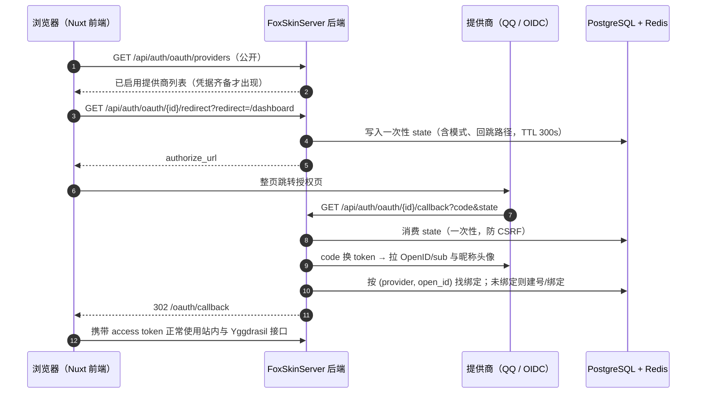

# 第三方登录扩展组件：QQ 与 OIDC

本文说明 FoxSkinServer 内置的第三方登录扩展组件：它以提供商 SPI + 绑定表 + 回调流程的形式
把"用 QQ / 任意 OIDC 身份商登录皮肤站"做成可独立启停的组件，参照 Blessing Skin 生态中
Socialite 扩展的使用习惯，但不需要额外安装插件。

## 1. 设计概览

组件由四部分组成，全部位于 `service/oauth` 与 `controller/OAuthController`：

| 部分 | 职责 |
| --- | --- |
| `OAuthProvider` SPI | 提供商契约：授权页地址、授权码换取身份；新渠道只需实现并注册 Bean |
| `QQOAuthProvider` / `OidcOAuthProvider` | QQ 互联与通用 OIDC 的协议实现 |
| `OAuthConnectionService` | 绑定关系与用户落地：首登建号、绑定、解绑保护 |
| `OAuthStateStore` | Redis 一次性 state，防 CSRF 与回调伪造 |

## 2. 数据模型

- `user_connections` 表：`(provider, open_id)` 唯一，`user_id` 索引，由 JPA `ddl-auto=update` 自动建表，
  与项目"不做迁移脚本"的约定一致。
- 首次登录自动注册的用户：
  - 邮箱优先取提供商返回的 `email`（OIDC），被占用或缺失时使用占位邮箱
    `{provider}_{openid}@users.noreply.foxskin.local`；
  - 密码为随机 UUID 的 BCrypt 哈希（等价于"没有密码"）；
  - `verified=false`；站点开启 `YGGDRASIL_REQUIRE_VERIFIED` 时，需补全邮箱并完成验证后才能外置登录。

## 3. 配置

凭据全部通过环境变量 / `.env` 注入，**配置了凭据即启用对应提供商，全部留空则组件静默**：

| 环境变量 | 说明 |
| --- | --- |
| `FOXSKIN_OAUTH_PUBLIC_URL` | 站点对外地址，用于拼 redirect_uri；同域反代部署可留空（从请求头推导） |
| `FOXSKIN_OAUTH_FRONTEND_URL` | 前端地址；前后端分域（本地开发）必须配置，同域部署留空 |
| `FOXSKIN_OAUTH_QQ_CLIENT_ID` / `QQ_CLIENT_SECRET` | QQ 互联 AppID/AppKey，配置后启用 QQ 登录 |
| `FOXSKIN_OAUTH_OIDC_ISSUER` / `OIDC_CLIENT_ID` / `OIDC_CLIENT_SECRET` | 通用 OIDC，配置后启用 |
| `FOXSKIN_OAUTH_STATE_TTL_SECONDS` | state 有效期，默认 300 秒 |

### 3.1 QQ 互联

1. 在 [QQ 互联](https://connect.qq.com) 创建"网站应用"，回调域登记为站点域名；
2. 提供 AppID/AppKey；完整回调地址为 `{PUBLIC_URL}/api/auth/oauth/qq/callback`；
3. 授权链路遵循 QQ 互联文档：token 与 me 端点均按 GET + 查询参数调用，`fmt=json` 优先，
   并兼容旧实现的键值对与 JSONP 响应。

### 3.2 通用 OIDC

任何暴露 `/.well-known/openid-configuration` 的提供商均可接入（Keycloak、Authentik、Logto、
Authelia、Casdoor 等）。`FOXSKIN_OAUTH_OIDC_ISSUER` 填 Issuer 地址（含路径，如
`https://sso.example.com/realms/foxskin`），scope 默认 `openid profile email`。

> 实现说明：拿到 access_token 后读取 userinfo 端点获取 `sub`，不复核 id_token 签名。
> 令牌直接来自提供商 token 端点（全程 TLS），信任等价；这样规避了各提供商 id_token
> 签名算法（HS256/RS256/EdDSA）与 JWKS 轮换的分歧，也不需要额外的密钥缓存设施。

## 4. API 一览

| 方法与路径 | 鉴权 | 说明 |
| --- | --- | --- |
| `GET /api/auth/oauth/providers` | 公开 | 已启用提供商：`[{id, display_name}]` |
| `GET /api/auth/oauth/{id}/redirect` | 公开（`mode=bind` 需登录） | 返回 `{authorize_url}`，`redirect` 参数限站内相对路径 |
| `GET /api/auth/oauth/{id}/callback` | 公开 | 提供商回跳落点，302 回前端 `/oauth/callback#...` |
| `GET /api/auth/connections` | 登录 | 当前用户绑定列表 |
| `DELETE /api/auth/connections/{id}` | 登录 | 解绑；占位邮箱用户只剩这一种登录方式时拒绝（403/400） |
| `POST /api/auth/register` | 公开 | 开放注册：email/username/password/nickname，成功即返回令牌 |

## 5. 扩展一个新提供商

1. 新建 `XxxOAuthProvider implements OAuthProvider`（`service/oauth` 包），实现
   `id/displayName/enabled/authorizeUrl/exchange`，`enabled` 依据自身凭据是否齐备；
2. 注册为 `@Component`，`OAuthProviderRegistry` 会自动收集；
3. 在 `application.yaml` 增加对应配置块与环境变量；
4. 前端无需改动：登录页与账户页按 `providers` 列表渲染。

## 6. 测试

- `OAuthConnectionServiceTest`：首登建号（占位邮箱、随机密码）、绑定冲突、解绑保护；
- `QQOAuthProviderTest`：授权页拼接、三段式换取、JSON/键值对/JSONP 兼容解析、错误载荷；
- `OidcOAuthProviderTest`：发现文档解析、token/userinfo 请求、声明映射、坏文档报错；
- `UserServiceRegisterTest`：注册参数校验与唯一性。

整理日期：2026-09-25。
